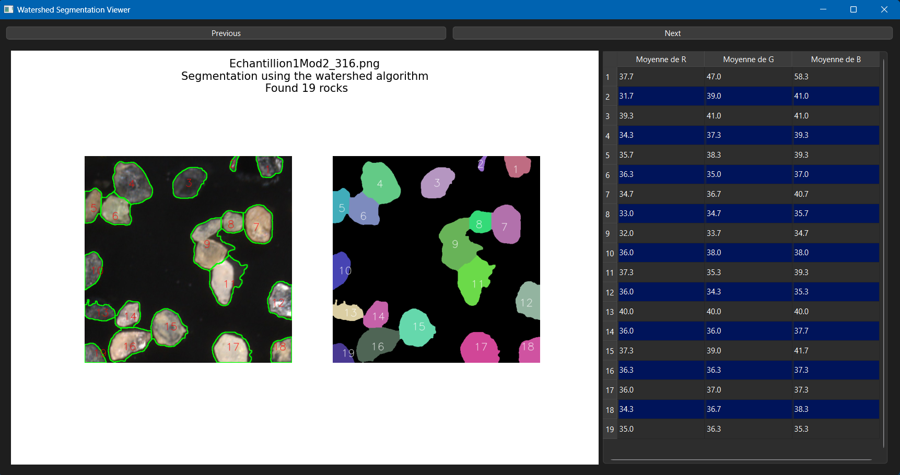

# rapport TP2 segmentation
8INF804 - Vision artificielle et traitement des images  
**Paul Fontaine** 

## Étapes de mon algorithme
J'ai conservé la méthode watershed
1. **Prétraitement de l'image**
   1. **Conversion en niveaux de gris**
   2. **Floutage léger**
   3. **Seuillage binaire pour séparer l'arrière-plan des cailloux**
   4.  **Ouverture pour enlever les petites tâches blanches**
   5.  **Fermeture pour combler les trous**
2. **Détection des marqueurs**
   1. **calcul de la distance par rapport à l'arrière-plan**
   2. **détection des maxima locaux / marqueurs (qui correspondent au centre des cailloux)**
   3. **étiquetage des marqueurs**
3. **application de l'algorithme watershed. chaque marqueur se "propage" pour devenir un segment**
4. **affichage des résultats**
   1. **détection des contours**
   2. **filtrage pour supprimer les segments trop petits**
   3. **affichage des contours**
   4. **coloration de chaque segment**
   5. **ajout de l'étiquette**
   6. **remplisssage du dataframe avec les moyennes pour chaque canal**

## exemple de résultat


## analyse de l'algorithme
Les performances sont relativement bonnes, j'évalue à ~10% le nomnbre de cailloux mal segmentés.  
La performance dépend éssentiellement de la détection des marqueurs. J'ai fine tuné mon algorithme sur la taille du noyau pour la détection des maxima locaux.
Un trop petit noyau peut trouver plusieurs marqueurs pour un seul caillou, un trop grand noyau peut regrouper plusieurs cailloux en un seul marqueur.
Pour éviter d'avoir plusieurs segments sur un seul caillou, j'ai introduit une distance minimale entre deux marqueurs
Dans l'idéal, il faut que les cailloux aient la même taille et soit plutôt ronds pour avoir une bonne segmentation.

## autres algorithmes
Je n'ai pas eesayé la méthode SLIC - K-Means car pour moi il faudrait le nombre de cailloux (K) pour utiliser K-Means.  
Les autres méthodes ne m'ont pas données de résultats satisfaisants comparés à watershed lors de leur première implémentation, ce qu'il fait que je n'ai pas cherché à les améliorer.

## Utilisation du script
Le code source est disponible sur github : [Paul-Fontaine/TP2_segmentation](https://github.com/Paul-Fontaine/TP2_segmentation/)  
  
Pour lancer le script avec l'affichage des résultats dans une fenêtre Qt, il suffit de lancer la commande suivante:  
```python segment_rocks_Qt.py Images```  
Sinon pour un affichage avec matplotlib et la console, lancez la commande suivante:  
```python main.py Images```

- le fichier `watershed.py`doit être dans le même répertoire que `segment_rocks_Qt.py`
- si le dossier `Images` n'est pas dans le même répertoire, spécifiez son chemin
- bibliothèques utiliséees : `opencv-python`, `numpy`, `pandas`, `matplotlib`, `PySide6`, `scipy`, `scikit-image`  
```pip install opencv-python numpy pandas matplotlib PySide6 scipy scikit-image```
- Je suis en python 3.11
